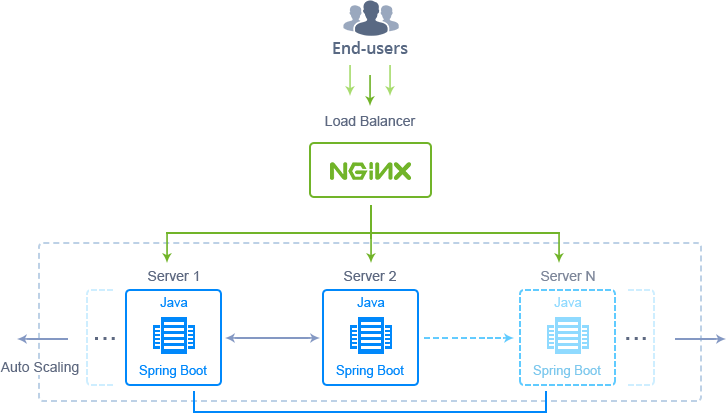
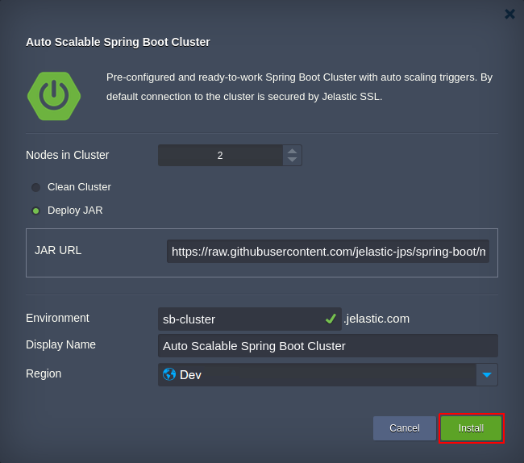

# Auto-Scalable Spring Boot Cluster 

Reliable [Spring Boot](https://projects.spring.io/spring-boot/) Сluster with preconfigured alerts on high load and smart auto-scaling configurations.

## Spring Boot Cluster Topology

During installation, you define a number of Spring Boot application servers in the cluster (up to 10 instances), which will be automatically [scaled in/out](https://docs.jelastic.com/automatic-horizontal-scaling) in order to handle the dynamically changing amount of incoming traffic. 

The current Spring Boot solution is implemented using the following software stacks:
- *Load balancer* (LB) - dockerized template with **_NGINX 1.10.1_**
- *Application server* (AS) - native template with **_Spring Boot 1.5.2_** on top of **_Java 8_** 

Herewith, each LB and AS container has the default [vertical scaling](https://docs.jelastic.com/automatic-vertical-scaling) range up to **16 cloudlets** (equals to 2 GiB of RAM and 6.4 GHz of CPU per node) for the required resources to be automatically allocated upon the necessity. In addition, connection to the cluster is secured with [Jelastic SSL](https://docs.jelastic.com/jelastic-ssl). 

Subsequently, any of these default settings can be adjusted - refer to the appropriate above-linked guides for the details.

## Auto-Scaling Configuration

The Spring Boot Cluster package automatically adjusts the number of application servers based on the consumption of resources as follows:
- +1 node if RAM/CPU usage is >70% for at least 5 minutes (up to 10 instances)
- -1 node if RAM/CPU usage is <40% for at least 5 minutes (but not less than a number of servers specified during installation)

The appropriate modifications are automatically applied to add or remove Spring Boot nodes, whilst you receive an [alert notification](https://docs.jelastic.com/load-alerts) about the corresponding load change.

In case you’d like to change the conditions of automatic scaling, adjust the appropriate triggers by following the [Automatic Horizontal Scaling](https://docs.jelastic.com/automatic-horizontal-scaling) guide.

## How to Install Auto-Scalable Spring Boot Cluster

The Spring Boot Cluster package deployment is completely automated and available for everyone:
- if having no Jelastic account yet, click **Deploy to Jelastic** to register for a trial period and install the package

- if you are already registered, log in to the Jelastic dashboard and [import](https://docs.jelastic.com/environment-import) a link to the [**_manifest.jps_**](https://github.com/jelastic-jps/spring-boot/blob/master/manifest.jps) file from the current repository

Fill in the installation form with the following data: 
- **_Nodes in Cluster_** - number of application servers your cluster should include
- choose deployment type:
   - **_Clean Cluster_** - to create bare cluster with no application inside
   - **_Deploy JAR_** - to deploy *JAR* application from the linked repo (where the default project is a message repository)

Type *Environment* name and, optionally, *Display Name* ([alias](https://docs.jelastic.com/environment-aliases)). Also, select the preferable [region](https://docs.jelastic.com/environment-regions) (if several ones are available) and click **Install**.

Wait a few minutes for Jelastic to prepare environment and configure the auto-scaling settings. 

For more information on working with Spring Boot in Jelastic Cloud, refer to the following [article](http://blog.jelastic.com/2017/04/27/hosting-spring-boot-java-applications/).
